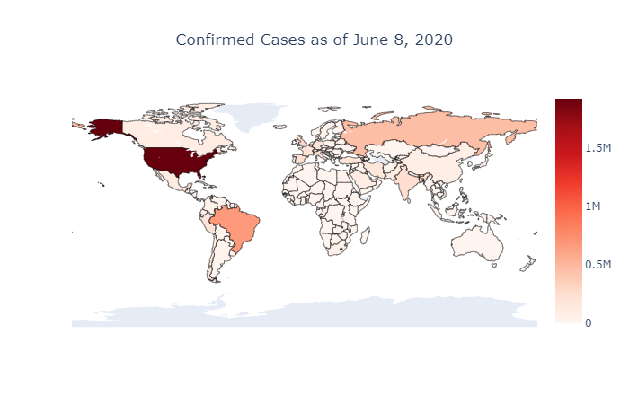
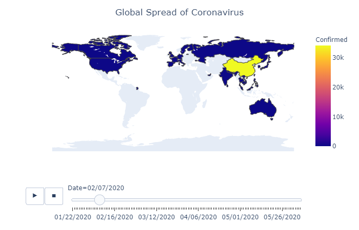
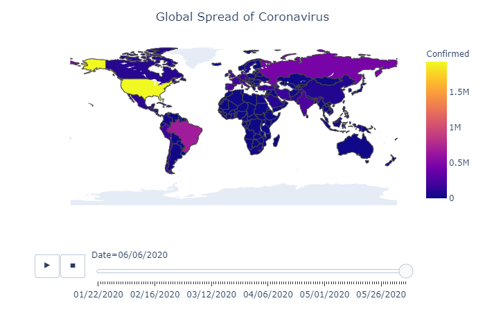

## Welcome to Matt's Data Science Portfolio Site

URL: [My_Portfolio_Site](https://midcenturydude7.github.io/My_Portfolio_Site/)

### [Project One: COVID-19 Data Visualization with Choropleth](https://github.com/midCenturyDude7/My_Portfolio_Site/tree/master/project_files)

#### Overview

- Simple data visualization pulling COVID-19 date from Kaggle

- Utilized the Choropleth library to create real-time visualizations of
COVID-19 data globally

- Developed both a graphical plot and frame-by-frame animation that utilizes a time sequence to show how the virus spread globally from the beginning of 2020 to the current date

#### Code

In addition to Choropleth library, utilized Python as the baseline programming language and baked in Numpy, Pandas and Plotly to manipulate and plot the data.

```markdown
# Import libraries
import numpy as np 
import pandas as pd 
import plotly as py
import plotly.express as px
import plotly.graph_objs as go
from plotly.subplots import make_subplots
from plotly.offline import download_plotlyjs, init_notebook_mode, plot, iplot
init_notebook_mode(connected=True)

```

#### Visualization

##### Plot 1 - Static



##### Plot 2(a) - Time Sequence Animation: February 2020



##### Plot 2(b) - Time Sequence Animation: June 2020


For more details see [GitHub Flavored Markdown](https://guides.github.com/features/mastering-markdown/).


